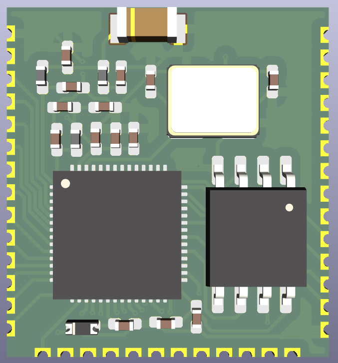
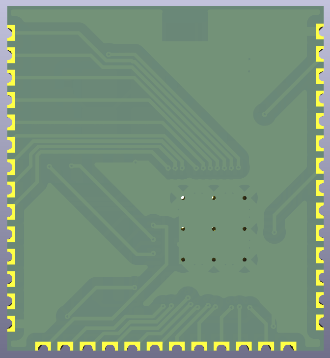
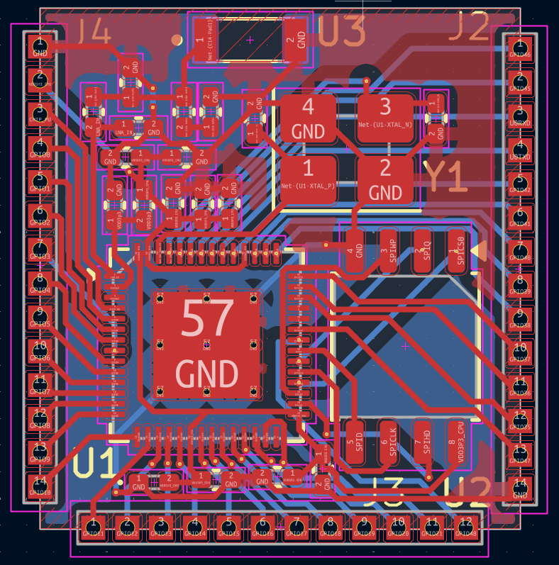
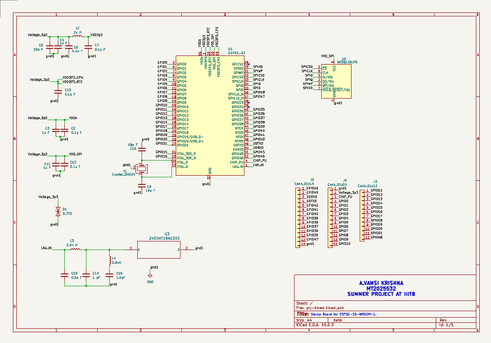

# ESP32-S3-WROOM-1 Compatible Stamp Board

<p align="center">
  
</p>

A custom **ESP32-S3-WROOM-1 compatible Stamp Board** designed using the **ESP32-S3 SoC** in **KiCad 10.0.1**.

This project was developed as part of the **Summer Project Programme** at the **International Institute of Information Technology Bangalore (IIIT Bangalore)** under the guidance of **Dr. Kurian Polachan**.

The design is inspired by the ESP32-S3-WROOM-1 reference module while replacing the integrated **PCB antenna** with a **Johanson 2450AT18A100E 2.4 GHz chip antenna**. It incorporates an RF impedance matching network, external QSPI Flash memory, a 40 MHz crystal oscillator, castellated edge pads, and all essential support circuitry required to function as a standalone ESP32-S3 module.

---

# Project Overview

This repository contains the complete KiCad project for a custom ESP32-S3 compatible stamp-board.

The repository includes:

- Complete schematic
- PCB layout
- PCB routing
- Custom symbol library
- Custom footprint libraries
- STEP 3D model
- Bill of Materials (BOM)
- Project images
- Complete KiCad project archive

---

# Project Preview

## 3D Front View

<p align="center">

</p>

---

## 3D Back View

<p align="center">

</p>

---

## PCB Layout

<p align="center">

</p>

---

## Schematic

<p align="center">

</p>

---

# Features

- Custom ESP32-S3 Stamp Board
- ESP32-S3-WROOM-1 compatible castellated edge pinout
- External Winbond W25Q128JVS 128-Mbit QSPI Flash
- 40 MHz crystal oscillator
- Johanson 2450AT18A100E 2.4 GHz chip antenna
- RF impedance matching network
- Compact two-layer PCB
- 3.3 V power supply
- EN reset circuitry
- Designed using KiCad 10.0.1

---

# Hardware Specifications

| Parameter | Description |
|------------|-------------|
| MCU | ESP32-S3 SoC |
| Flash Memory | Winbond W25Q128JVS (128 Mbit) |
| Crystal | 40 MHz |
| RF Antenna | Johanson 2450AT18A100E Chip Antenna |
| RF Matching | LC Matching Network |
| Operating Voltage | 3.3 V |
| PCB Layers | 2 |
| Module Type | Castellated Stamp Board |

---

# RF Matching Network

Unlike the original ESP32-S3-WROOM-1 module, which uses an onboard PCB antenna, this design employs a **Johanson 2450AT18A100E 2.4 GHz chip antenna**.

Since the impedance of a chip antenna depends on PCB dimensions, ground plane size, surrounding copper, and component placement, an **LC impedance matching network** is implemented between the ESP32-S3 RF output and the antenna.

The initial matching network values used in this project are:

| Component | Value |
|-----------|-------|
| L3 | 2.2 nH |
| L4 | 3.9 nH |
| C14 | 1.0 pF |
| C15 | 0.8 pF |
| C16 | 1.5 pF |

### Design Justification

The selected values represent practical initial values commonly used in **2.4 GHz Wi-Fi/Bluetooth RF matching networks**.

- Series inductors between **1–5 nH** are commonly used for impedance transformation.
- Shunt capacitors between **0.5–2 pF** provide fine impedance tuning.
- The matching network transforms the chip antenna impedance so that the ESP32-S3 RF port sees approximately **50 Ω**, minimizing reflections and maximizing RF power transfer.

These values serve as an initial implementation and should ideally be optimized after PCB fabrication using **S11 measurements** obtained from a **Vector Network Analyzer (VNA)**.

---

# Crystal Oscillator

The ESP32-S3 uses a **40 MHz crystal oscillator** as its primary clock source.

The selected crystal load capacitors are:

| Component | Value |
|-----------|-------|
| C1 | 18 pF |
| C4 | 18 pF |

These values represent standard starting values commonly used with 40 MHz crystal oscillators to ensure reliable oscillator startup and stable operation.

---

# Software & Design Tools

The hardware design was developed using:

- KiCad 10.0.1
- KiCad Schematic Editor
- KiCad PCB Editor
- KiCad Footprint Editor
- KiCad 3D Viewer

---

# Passive Component Footprints

All resistors, capacitors and inductors use the following footprint:

```
0603_1608Metric_Pad1.08x0.95mm_HandSolder
```

---

# Custom Libraries

The project uses custom libraries for symbols, footprints and 3D models.

### Symbol Library

```
Chip-Antenna.kicad_sym
```

### Footprint Libraries

```
myESP32_library.pretty
chip.pretty
```

These custom libraries contain the symbols, footprints and associated 3D models required for the project.

---

# Repository Structure

```
ESP32-S3-WROOM-1-Stamp_Board
│
├── images/
│   ├── 3D-View_front.png
│   ├── 3D-View_back.png
│   ├── LAYOUT.png
│   └── SCHEMATIC.png
│
├── chip.pretty/
├── myESP32_library.pretty/
├── Chip-Antenna.kicad_sym
├── BOM.csv
├── smr_prj_532`.zip
├── README.md
└── LICENSE
```

---

# Complete Project Archive

The repository includes a compressed archive containing the complete KiCad project.

The archive contains:

- KiCad project files
- PCB layout
- Schematic
- Custom symbol library
- Custom footprint libraries
- STEP 3D model
- Bill of Materials
- Project images

Extract the archive and open the **`.kicad_pro`** file using **KiCad 10.0.1**.

---

# Acknowledgement

This project was carried out as part of the **Summer Project Programme** at the **International Institute of Information Technology Bangalore (IIIT Bangalore)**.

I would like to express my sincere gratitude to **Dr. Kurian Polachan** for his guidance, encouragement, and valuable technical insights throughout the design and development of this project.

---

# License

This project is released under the **MIT License**.

---

# Author

**Vamsi Arya**

M.Tech, Electronics and Communication Engineering

International Institute of Information Technology Bangalore (IIIT Bangalore)
